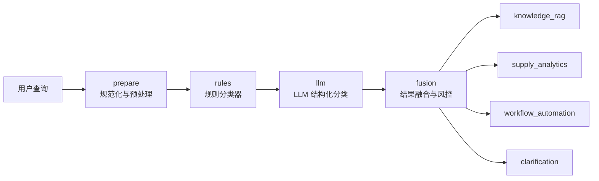

# 企业 Agent 意图识别与路由原型

这是一个面向企业 Agent 系统的生产级意图识别与路由原型，目标不是做一个简单聊天 demo，而是做一条更接近真实企业落地的“请求分析中枢”。

它负责把用户输入的业务请求稳定地分发到三个核心子系统：

- 企业私域知识库 RAG 检索
- 企业供应量数据查询与分析报告
- 供应量相关工作流自动化执行

当前实现同时覆盖了后端路由内核、可视化前端控制台、样例数据、接口测试和 LLM 不可用时的降级兜底。

## 这个项目解决什么问题

企业内部的 Agent 系统通常不会只有一个能力源，而是会同时连接多个子系统：

- 一个系统负责检索企业知识库、SOP、制度和 FAQ
- 一个系统负责查供应量、交付量、达成率、波动趋势，并输出分析报告
- 一个系统负责发起审批、异常预警、通知、同步和流程执行

真实用户的输入往往不是“标准化 API 参数”，而是自然语言，例如：

- “请从知识库检索供应异常升级 SOP，并总结升级条件”
- “分析华东智造近三个月动力电池模组供应量波动并生成报告”
- “触发供应异常预警流程并通知采购负责人”
- “帮我看一下供应量异常，并顺便执行补货审批流程”

难点不在于“回答问题”，而在于先判断这个请求到底属于哪个业务域，缺不缺关键槽位，是否存在跨域冲突，是否需要执行确认，然后再把它送到正确的子系统。

这个项目就是围绕这件事设计的。

## 核心设计目标

- 生产容错优先：即使 LLM 不可用，系统也能继续工作
- 路由先于执行：先分类、再判断风险、最后才允许执行动作
- 可追踪：每一步都记录结构化 trace，方便前端展示和后续监控
- 可扩展：后续可以继续接入真正的 RAG、真实数据库和真实工作流引擎
- 前后端同构：后端输出什么，前端就能直接展示什么

## 整体架构

系统分成四层：

1. 接口层
2. 意图识别与路由层
3. 子系统执行层
4. 前端可视化层

对应代码位置：

- `app/main.py`：FastAPI 服务入口
- `app/intent_engine.py`：意图识别、LLM 判定、融合策略、LangGraph 工作流
- `app/services/`：三个业务子系统
- `app/models.py`：请求、分类结果、trace、子系统输出模型
- `app/static/`：前端控制台页面
- `data/`：样例知识库、供应量数据、工作流目录

## 意图识别与路由链路

整个链路不是单步分类，而是一条固定模板的工作流：



也就是：

1. `prepare`
2. `rules`
3. `llm`
4. `fusion`
5. `knowledge_rag | supply_analytics | workflow_automation | clarification`

这个固定流程由 LangGraph 编排，不同节点只负责自己那一层职责，这样后面替换分类器、接入审计、增加监控都比较方便。

## 四类意图是怎么定义的

### `knowledge_rag`

适用于这类请求：

- 查询企业知识库
- 查询制度、规范、SOP、FAQ、手册、流程说明
- 重点是“找文档内容”而不是“算数据”

典型例子：

- “检索供应异常升级 SOP”
- “查一下补货审批流程说明”
- “知识库里有没有交付延误通知模板”

### `supply_analytics`

适用于这类请求：

- 查询供应量、计划量、实际量、交付量
- 统计达成率、异常、波动、同比、环比
- 输出分析报告、周报、汇总结论

典型例子：

- “分析近三个月华东智造供应量波动”
- “统计海岳材料 3 月交付达成率”
- “生成一份供应量异常分析报告”

### `workflow_automation`

适用于这类请求：

- 发起、触发、执行业务流程
- 发送通知、同步系统、写回结果
- 明显包含动作执行意图

典型例子：

- “触发供应异常预警流程”
- “启动补货审批流程”
- “同步周产能数据并通知采购负责人”

### `clarification`

适用于这些场景：

- 用户问题太模糊
- 同时混了多个业务域且系统无法稳定判断
- 缺少关键槽位，直接执行风险太高

典型例子：

- “帮我处理一下这个问题”
- “看看供应量，并顺便走流程”
- “执行流程”但没有说清楚是哪个流程

## 每个节点具体做什么

### 1. `prepare`

这一层先做统一预处理：

- 文本规范化
- 去除多余空白
- 大小写统一
- 把后续规则分类和 LLM 分类都需要的标准化查询先准备好

它的作用很简单，但非常重要，因为生产环境里很多分类误差都来自输入不规整。

### 2. `rules`

这是第一层稳定性保障，规则分类器负责做“高可控的首轮识别”。

规则分类器会做几件事：

- 基于关键词给每个意图域打分
- 提取供应商、物料、工作流名称、时间范围、知识主题、动作动词
- 判断是否命中高风险动作词
- 判断是否存在多阶段请求
- 判断是否缺少关键槽位

例如：

- 命中“知识库、SOP、制度”会推高 `knowledge_rag`
- 命中“供应量、达成率、趋势、报告”会推高 `supply_analytics`
- 命中“触发、执行、通知、工作流”会推高 `workflow_automation`

规则分类器的价值不在于“最聪明”，而在于：

- 稳定
- 可解释
- 可控
- 在 LLM 不可用时仍然能继续服务

### 3. `llm`

这一层不是自由文本输出，而是 LangChain 的结构化分类。

系统使用：

- `ChatOpenAI.with_structured_output(...)`

让 LLM 直接返回结构化字段，而不是返回一段难以解析的自然语言。结构化结果包含：

- `primary_intent`
- `secondary_intents`
- `route_target`
- `confidence`
- `requires_confirmation`
- `missing_slots`
- `normalized_query`
- `rationale`
- `extracted_entities`
- `risk_flags`
- `candidate_scores`
- `evidence`

这样设计的好处是：

- 后端不用再写脆弱的文本解析逻辑
- 前端可以直接展示结果
- 后面接监控、审计、A/B 实验会更方便

### 4. `fusion`

规则结果和 LLM 结果不会直接二选一，而是会经过一层融合策略。

融合策略大致分三类：

- 两者一致：优先采用 LLM 结果，并提升综合置信度
- 两者不一致，但一方明显更强：采用更高置信度的一方
- 两者不一致且差距不大：转入 `clarification`，避免误路由

这一步是生产系统里非常关键的一层，因为“模型判断有时候不稳定”是常态，不能把路由权完全裸交给单一分类器。

### 5. 子系统执行

融合完成后，系统会按最终结果进入对应子系统：

- `knowledge_rag`
- `supply_analytics`
- `workflow_automation`
- `clarification`

这里的子系统目前是样例服务，但接口形状已经按真实生产接法来设计。

## 规则分类器是怎么判断的

规则分类器并不是简单 if/else，而是“信号打分 + 实体提取 + 风险评估”的组合。

### 关键词打分

每个意图域有一组业务关键词和权重。例如：

- `knowledge_rag`：知识库、文档、制度、SOP、FAQ、手册
- `supply_analytics`：供应量、交付量、达成率、趋势、波动、分析、报告
- `workflow_automation`：工作流、触发、执行、通知、回写、审批

每命中一个关键词，就会给对应意图域增加一定分数。

### 实体提取

系统还会提取一些关键业务实体：

- `suppliers`
- `materials`
- `metrics`
- `time_range`
- `workflow_name`
- `knowledge_topics`
- `action_verb`

这些实体有两个作用：

- 帮助分类
- 帮助后续子系统执行

例如：

- 识别到供应商和物料，会增强 `supply_analytics`
- 识别到工作流名称，会增强 `workflow_automation`
- 识别到知识主题，会增强 `knowledge_rag`

### 风险标记

系统还会打出一些风险标签，例如：

- `high_risk_action`
- `multi_stage_request`
- `cross_domain_request`
- `missing_critical_slots`
- `rule_low_confidence`
- `execution_guardrail_enabled`

这些标签不是为了“好看”，而是为后续执行护栏、审计、前端提示做准备。

## 槽位缺失是怎么判断的

系统不会只判断意图，还会判断“现在是否适合真正进入子系统”。

例如：

- 工作流类请求如果没有 `workflow_name`，就会补 `missing_slots=["workflow_name"]`
- 数据分析类请求如果明显要出报告但没有时间范围，就会补 `missing_slots=["time_range"]`
- 知识库类请求如果用户只说“查知识库”但没有主题，就会补 `missing_slots=["knowledge_topic"]`

如果关键槽位缺失，系统会倾向：

- 要求确认
- 增加风险标记
- 必要时进入 `clarification`

## 为什么需要 `clarification`

生产场景里最危险的事情不是“回答得不够漂亮”，而是“路由错了还继续执行”。

所以这里专门保留了一个 `clarification` 分支，用来拦截这些高风险场景：

- 请求过于模糊
- 跨域意图很强，但无法稳定判断主意图
- 工作流动作已经识别出来，但缺少关键参数
- 规则和 LLM 明显分歧，且没有任何一方足够强

当进入 `clarification` 时，系统不会盲目执行，而是明确告诉前端：

- 当前缺了什么
- 为什么不适合直接路由
- 建议用户补充什么信息

## 为什么工作流执行要带护栏

`workflow_automation` 和前两个子系统最大的区别是，它可能会触发真实动作。

所以系统默认增加了两层保护：

- `requires_confirmation`
- `dry_run`

这意味着：

- 即使识别出工作流意图，也不会默认直接执行
- 如果没有显式允许执行，就只生成执行计划
- 前端会把这件事展示出来

这套机制是后续接真实审批流、幂等机制、审计日志的基础。

## 当前三个子系统分别怎么工作

### 知识库子系统

当前是一个基于样例 JSON 文档的轻量检索服务。

它会：

- 结合查询词和知识主题做简单匹配
- 返回 Top K 文档
- 给出标题、标签、得分和摘要片段

它现在不是向量检索，但接口已经符合后续替换成真实 RAG 的方向。

### 供应量分析子系统

当前基于样例供应量数据表做筛选与汇总分析。

它会：

- 按供应商、物料、时间范围过滤
- 统计计划量、实际量、交付量
- 计算达成率、交付率、缺口量
- 输出异常记录和月度 breakdown

这个子系统已经具备“分析报告接口”的基本形状，后面可替换成真实数据库查询或数据仓库查询。

### 工作流自动化子系统

当前基于样例工作流目录生成执行计划。

它会：

- 匹配工作流名称
- 识别执行模式是 `dry_run` 还是 `execute`
- 生成审计 ID
- 返回执行步骤和建议动作

目前默认更偏“执行前规划器”，这符合企业系统里先审批、后执行的生产节奏。

## API 返回结构长什么样

接口：

- `GET /api/health`
- `POST /api/query`

请求示例：

```json
{
  "query": "分析华东智造近三个月动力电池模组供应量波动并生成报告。",
  "allow_action_execution": false,
  "dry_run": true,
  "trace": true
}
```

响应核心结构：

```json
{
  "request_id": "req-xxxx",
  "classification": {
    "primary_intent": "supply_analytics",
    "route_target": "supply_analytics",
    "confidence": 0.82,
    "requires_confirmation": false,
    "missing_slots": [],
    "risk_flags": ["cross_domain_request"]
  },
  "rule_decision": {},
  "llm_decision": {},
  "subsystem_result": {},
  "trace": []
}
```

重点字段说明：

- `classification`：最终融合结果
- `rule_decision`：规则分类器输出
- `llm_decision`：LLM 分类器输出，若不可用则为空
- `subsystem_result`：实际进入的子系统返回
- `trace`：完整链路轨迹

## trace 为什么重要

很多 demo 只给最终答案，但生产系统更需要“为什么走到这里”。

`trace` 里会记录每个节点：

- 当前阶段名
- 当前阶段说明
- 当前阶段的关键 payload

前端会直接把这些 trace 渲染出来，所以你能看到：

- 规则阶段怎么判断的
- LLM 是否成功参与
- 融合阶段为什么选了这个目标
- 最终进入了哪个子系统

这对下面这些事情很有帮助：

- 排查误路由
- 对比规则与 LLM 的差异
- 做线上问题复盘
- 给后续埋点和监控提供基础数据

## LLM 不可用时会发生什么

这个项目默认支持“LLM 增强，但不依赖 LLM 才能活”。

如果出现以下情况：

- 没配模型参数
- Token 失效
- 模型接口报错
- 网络不可用

系统会自动退化为：

- 仅使用规则分类器
- 保留同样的工作流结构
- 保留同样的 API 返回结构
- 保留同样的前端展示方式

这意味着：

- 前端不会因为 LLM 出问题而全挂
- 路由服务不会因为模型抖动而失去可用性
- 你可以先做工程联调，再逐步接入真实模型

## 前端控制台能看到什么

页面中会展示：

- 健康状态
- LLM 分类器状态
- 输入请求区域
- 工作流执行开关和 dry-run 开关
- 最终识别结果
- 规则判定、LLM 判定、融合结果
- 子系统返回
- trace 执行轨迹

它的价值不是做漂亮聊天框，而是把“意图识别与路由链路”透明化。

## 当前目录结构

```text
app/
  config.py
  intent_engine.py
  main.py
  models.py
  services/
    knowledge_base.py
    supply_analytics.py
    workflow_automation.py
  static/
    index.html
    styles.css
    app.js
data/
  knowledge_base.json
  supply_records.json
  workflow_catalog.json
tests/
  test_api.py
docs/
  superpowers/specs/
```

## 运行方式

1. 确认虚拟环境可用。

2. 安装依赖。

```bash
uv pip install --python ./.venv/bin/python fastapi uvicorn
```

3. 检查 `.env`。

当前仓库里的示例 token 已失效。如果你希望启用 LLM 结构化分类，需要替换为可用的：

- `LLM_API_KEY`
- `LLM_BASE_URL`
- `LLM_MODEL_ID`

4. 启动服务。

```bash
./.venv/bin/python -m uvicorn app.main:app --host 127.0.0.1 --port 8010
```

5. 打开浏览器访问：

[http://127.0.0.1:8010](http://127.0.0.1:8010)

## 测试

运行单元测试：

```bash
./.venv/bin/python -m unittest discover -s tests -p 'test_*.py'
```

当前测试覆盖：

- 健康检查
- 知识库路由
- 供应量分析路由
- 工作流自动化路由

## 已完成内容

- 生产风格的规则分类器
- LangChain 结构化意图分类接口
- LangGraph 路由工作流
- 风险标记和槽位缺失判断
- 子系统执行护栏
- 前端控制台
- 样例知识库、样例供应量数据、样例工作流目录
- 接口测试

## 下一步推荐演进方向

- 把知识库子系统替换为真实向量检索和召回重排
- 把供应量分析子系统替换为真实数据库或数仓查询
- 把工作流执行子系统接入真实审批系统和任务系统
- 增加租户、权限、审计日志和观测埋点
- 引入分类评估集和离线回放测试
- 增加更细粒度的意图层级，例如“问答 / 报表 / 执行 / 复盘 / 预警”
